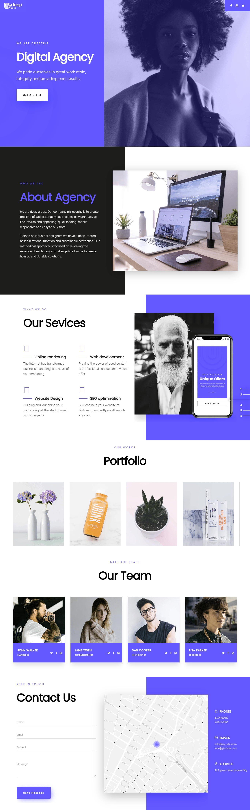

# Edge One Landing Page

I've implemented the following design using only HTML and CSS, some elements needed Javascript like the map and also some images might not be the same since i didn't find them.

The website is fully responsive, I've used a desktop-first methodology and build media queries for mobile.